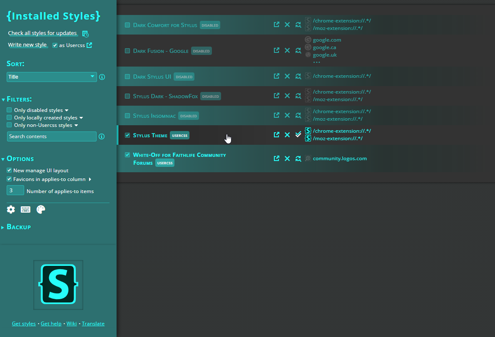
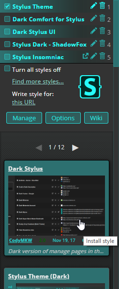

# Stylus Theme

A theme based on the Stylus logo.

## Using the Theme

### Install the Stylus Browser Plugin

[ Stylus](https://add0n.com/stylus.html) is a browser extension for Chrome, Firefox, and Opera that allows you to override the styling of websites, to change their appearance.

  * [Stylus for Chrome](https://chrome.google.com/webstore/detail/clngdbkpkpeebahjckkjfobafhncgmne)
  * [Stylus for Firefox](https://addons.mozilla.org/firefox/addon/styl-us/)
  * [Stylus for Opera](https://addons.opera.com/extensions/details/stylus/)

### Install the Theme

Once you've installed Stylus, you are ready to install the theme:

  * From its home page at [OpenUserCSS](https://openusercss.org/)

Or directly from here:

  * 

## Gallery

